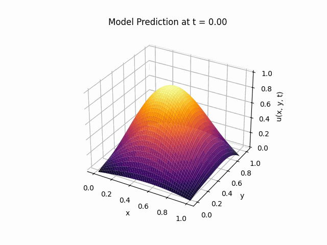
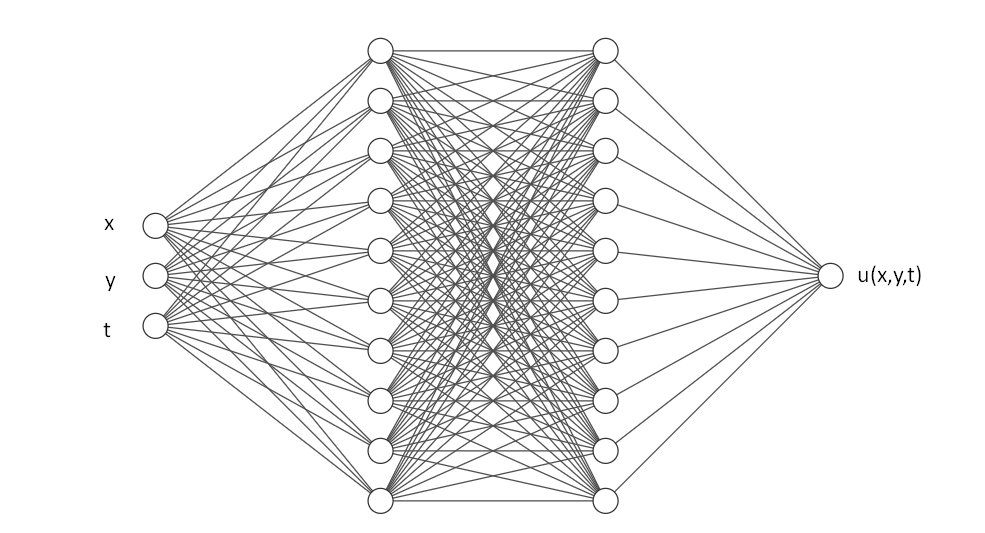
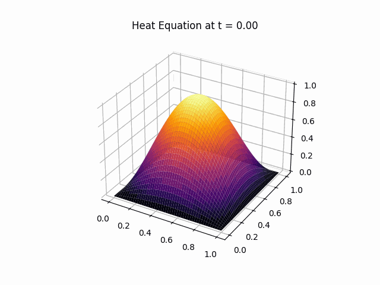
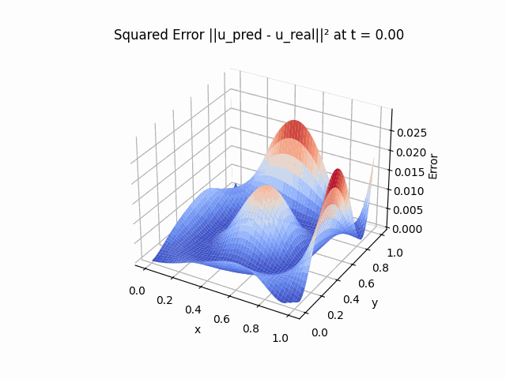
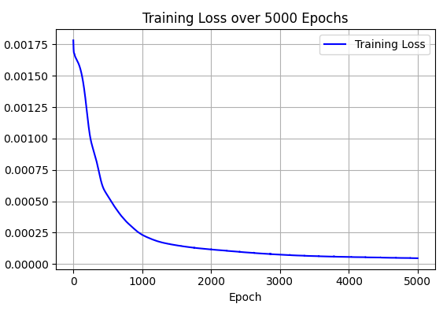
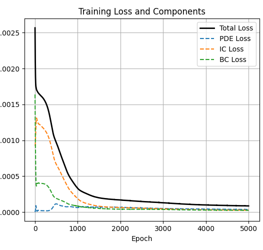

# pinn_2d_heat_equation
### Physics Informed Neural Network predicting temperature on a surface with Dirichlet boundary conditions.
PINNs are neural networks trained not only on data but also to satisfy **underlying physical laws**, represented as differential equations. Here, we solve a PDE **without labeled training data** — only the governing equation and boundary/initial conditions are used during training.

## Equation and model description
For values of $0 <= x, y, z <= 1$ we know that the heat equation is   
$` \frac{\partial u}{\partial t} = \alpha \left( \frac{\partial^2 u}{\partial x^2} + \frac{\partial^2 u}{\partial y^2} \right) `$
  
Given the boundary condition   
$`u(x, y, t) = 0 \quad \text{for} \quad (x, y) \in \partial \Omega, \quad t > 0$  
and the initial condition  
$u(x, y, 0) = \sin(\pi x) \sin(\pi y) \quad \text{for} \quad (x, y) \in \Omega$  
we train a PINN to predict the scalar output $u(x, y, t)$ for a $0 <= x ,y ,z <= 1$ pair input using the analytic solution of the PDE and the conditions as our loss function.
## Model architecture
We train a simple fully connected MPL with 3 input channels, 2 hidden layers of 10 nodes each and the single output which represents the scalar value - temperature at given coordinates. Tanh activations are used in the hidden and output layers. 
 

 
## Loss functionn and training
For the loss function we use a weighted sum of the 3 condition a prediction must satisfy (original PDE, Initial condition, Boundary condition) and we minimize the loss. Thus we are trying to minimize:  
$L_{final} = λ_1L_{IC} + λ_2L_{PDE} + λ_3L_{BC}$  
where  
$L_{\text{PDE}} = \frac{1}{N_f} \sum_{i=1}^{N_f} \left| \frac{\partial u}{\partial t}(x_i, y_i, t_i) - \alpha \left( \frac{\partial^2 u}{\partial x^2}(x_i, y_i, t_i) + \frac{\partial^2 u}{\partial y^2}(x_i, y_i, t_i) \right) \right|^2$,  

$L_{\text{IC}} = \frac{1}{N_0} \sum_{i=1}^{N_0} \left| u(x_i, y_i, 0) - u_0(x_i, y_i) \right|^2$, and  

$L_{\text{BC}} = \frac{1}{N_b} \sum_{i=1}^{N_b} \left| u(x_i, y_i, t_i) - g(x_i, y_i, t_i) \right|^2$.
 
We use Adam as optimizer and train over 5000 epochs on a mesh grid on $R^3$ with step = 0.01. 
## Graphs and precision

We can visualize model performance over all inputs by a time animation on the surface $0 <= x, y <= 1$, for the constant $α=0.05$. 

 
For this particular heat equation, we know the true solution analytically which is
$u(x, y, t) = \sin(\pi x) \sin(\pi y) e^{-2\pi^2 \alpha t}$<br$
and there fore we can plot (simulate) the actuall heat diffusion over the timespan of a second: 

 
We notice a small difference in the edges of the surface - the boundary conditions. This is because the mesh grid - collocation points start from 0.01, however for larger epoch numbers the difference is minimzed even further and is ignorant. We plot the difference using a simple MSE difference 
$|u_θ-u_{pred}|^2$  
and we visualize the error at every point: 

 
### Loss over epochs
The weights $λ_1, λ_2, λ_3$ used in the loss function are 0.01, 0.05 and 0.01 respectively. The training loss drops relatively quickly, especially when compared to 
not using weights: 

 
We also plot all of the losses individually:
 
 

